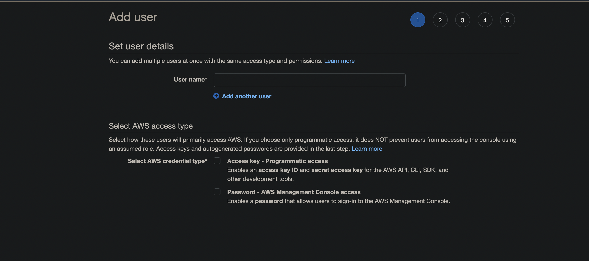

#  Java Spring Framework Refresher

Quick refresher on Java Spring Framework with REST Webservices.

## Spring Framework

Spring Framework is a Java platform that provides comprehensive infrastructure support for developing Java applications. Spring handles the infrastructure so you can focus on your application.

## Start up

1. Prefered IDE: VSCode
2. VSCode extensions: 
- Spring Boot Dashboard
- Spring Boot Extension Pack
- Spring Boot Tools
- Spring Initializer Java Support
- Test Runner for Java
- Maven for Java
- Debugger for Java
- Extension Pack for Java
- Java prettier formatter
- XML
3. Start webservices: `./mvnw spring-boot:run` or VSCode UI

## Running Web Services App
1. Build your project with `mvn install` command
2. Upload the deployable `.jar` file to a production server
3. Run application with `java -jar` <filname> command

### Running Webservices without STS
1. Navigate to `/mobile-app-ws` directroy folder
2. Run `./mvnw install` this will compile, build the project and unit tests
3. Run `./mvnw spring-boot:run` this will run the RESTful webservices application in a apache tomcat server container

### Running Application as a Java App (with a Apache tomcat container)
1. `Run `./mvnw install` this will compile, build the project and unit tests (create jar in target)
2. `cd /mobile-app-ws/target`
3. `cp mobile-app-ws-0.0.1-SNAPSHOT.jar /Users/{user-name}/Desktop`
4. Navigate to desktop where the jar has been copied
5. `java -jar mobile-app-ws-0.0.1-SNAPSHOT.jar`

### Running Application as a War file (on an existing Apache tomcat container [Mac])
1. Update `pom.xml` -> 
```
<packaging>war</packaging>
```
2. `./mvnw clean` clears out target folder
3. `./mvnw install` creates the war package in `/target`
4. Install tomcat zip from http://tomcat.apache.org (with the appropriate corrosponding java version)
5. Unzip on to desktop
6. Switch directories to `cd /Desktop/apache-tomcat-9.0.65/bin/
7. Elevate permissions to make script files executable `chmod a+x *.sh`
8. Run `./startup.sh`
9. Navigate to http://localhost:8080 (tomat is running!)
10. Run `./shutdown.sh`
11. Create Tomcat user for deployments
12. Switch directoires to `cd /Desktop/apach-tomcat-9.0.65/conf`
13. Open `tomcat-users.xml`
14. Add 
``` 
<role rolename="manager-gui"/>
<user username="admin" password="admin" roles="manager-gui"/>
```
15. Go to maven project directory where the war package has been created `/mobile-app-ws/target/`
16. Rename `mobile-app-ws-0.0.1-SNAPSHOT.war` -> `mobile-app-ws.war`
17. Deploy war on tomcat 'WAR file to deploy': 

18. Webservices are deployed :)

### Deploying to Amazon Cloud EC2

#### Create EC2 Linux Instance
1. Login to https://aws.amazon.com/
2. Navigate to EC2 Dashboard
3. Select availability zone

4. Select 'Launch instance'
5. Configuration settings:
- Name and tags: 'DemoAPIServer'
- App and OS Images: Amazon Linux (Free tier)
- Instance type: t2.micro (Free tier)
- Key pair (login): Create private key for login
- Storage (volumes): 8GB (Free tier)
- Network settings: SSH, HTTP, HTTPS, Custom TCP port 8080
- Advanced settings: Shutdown behaviour: Stop
6. Launch the instance
#### Connect to EC2 via SSH
7. Navigate to EC2 Running containers 
8. Get Public IPv4 DNS name to start SSH the connection
9. SSH into AWS instance:
- `sudo su` (if required)
- `chmod 400 myprivatekey.cer` (if required)
- `ssh -i myprivatekey.cer ec2-user@{DNS-name}`
#### Update EC2 and install Java
10. Install updates: `sudo yum update`
11. Check Java version: `sudo java -version`
12. Check all Java packages available: `sudo yum list java`
13. Install Java: `sudo yum install java-1.8.0`
14. Switch Java version:
- `sudo /usr/sbin/alternatives --config java`
- `sudo /usr/sbin/alternatives --config javac`
#### Download and install Tomcat
15. Go to https://tomcat.apache.org/ select the version and get the url link for the `tar.gz` file type
16. Download tomcat with the link extracted (example):`sudo wget https://dlcdn.apache.org/tomcat/tomcat-9/v9.0.65/bin/apache-tomcat-9.0.65.tar.gz`
17. Check file is there: `ls`
18. Extract files: `sudo tar xvf apache-tomcat-9.0.65.tar.gz -C /usr/share`
19. Check its extracted: `ls -lrt /usr/share`
20. Rename tomact directory: `sudo ln -s /usr/share/apache-tomcat-9.0.65 /usr/share/tomcat9`
21. `ls -lrt /usr/share` is now: `tomcat9 -> /usr/share/apache-tomcat-9.0.65` :)
#### Configure remote access to Manager app
22. Create a new tomcat group: 
- `sudo groupadd --system tomcat`
- `sudo useradd -d /usr/share/tomcat9 -r -s /bin/false -g tomcat tomcat`
- `sudo chown -R tomcat:tomcat /usr/share/apache-tomcat-9.0.65` (set tomcat folder permissions for this new user)
23. Make tomcat start on reboot (will need to create a service file)
- `sudo vi /etc/systemd/system/tomcat9.service`
- Copy and paste these setting into this file:
```
[Unit]
Description=Tomcat Server
After=syslog.target network.target

[Service]
Type=forking
User=tomcat
Group=tomcat

Environment=JAVA_HOME=/usr/lib/jvm/jre
Environment='JAVA_OPTS=-Djava.awt.headless=true'
Environment=CATALINA_HOME=/usr/share/tomcat9
Environment=CATALINA_BASE=/usr/share/tomcat9
Environment=CATALINA_PID=/usr/share/tomcat9/temp/tomcat.pid
Environment='CATALINA_OPTS=-Xms512M -Xmx1024M'
ExecStart=/usr/share/tomcat9/bin/catalina.sh start
ExecStop=/usr/share/tomcat9/bin/catalina.sh stop

[Install]
WantedBy=multi-user.target

```
- `sudo systemctl daemon-reload`
24. Start tomcat
- `sudo systemctl enable tomcat9`
- `sudo systemctl start tomcat9` (to stop `sudo systemctl stop tomcat9`)
25. Navigate to tomcat URL
- {AWS Public IPv4 DNS}.com:8080
26. `sudo vi /usr/share/tomcat9/webapps/manager/META-INF/context.xml`
- Comment out line (key i -> INSERT to edit):
```
  <!--  <Valve className="org.apache.catalina.valves.RemoteAddrValve"
  allow="127\.\d+\.\d+\.\d+|::1|0:0:0:0:0:0:0:1" /> -->
```
- esc + `:wq` to save changes
- sudo systemctl restart tomcat9
#### Configure Tomcat users
27. `sudo vi /usr/share/tomcat9/conf/tomcat-users.xml`
- (Copy and paste from the tomcat 401 page) (key i -> INSERT to edit):
```
<role rolename="manager-gui"/>
<user username="tomcat" password="s3cret" roles="manager-gui"/>
```
- esc + `:wq` to save changes
28. `sudo systemctl restart tomcat9`
#### Install MySQL
29. `sudo yum install https://dev.mysql.com/get/mysql80-community-release-el7-6.noarch.rpm`
30. `sudo amazon-linux-extras install epel -y`
31. `sudo yum install mysql-community-server`
- Optional: Navigate to `/etc/yum.repos.d/mysql-community.repo` and disable gpg if you trust repos
```
gpgcheck=0
```
32. `sudo systemctl enable --now mysqld`
33. `systemctl status mysqld`
34. `sudo grep 'temporary password' /var/log/mysqld.log`
35. `sudo mysql_secure_installation`
- Set new password
- Remove anonymous users? - Yes
- Disallow root login remotely? - Yes
- Remove test Database? - Yes
- Reload privilege tables now? - Yes
36. `mysql -u root -p`
- Login
#### Create database and add user
37. Sign into user root: `mysql -u root -p`
38. `create database photo_app;`
39. `show databases;`
40. `create user '{my username here}'@'localhost' identified by '{my password here}';`
41. `grant all privileges on photo_app.* to '{my username here}'@'localhost';`
42. Make changes to take affect: `flush privileges;`
43. `exit`
44. `mysql -u {my username here} -p;`
45. `show databases`;
#### Deploy webservices on tomcat 
46. Navigate to maven webservices project: e.g. `cd mobile-app-ws`
47. `./mvnw install`
48. Go to `cd mobile-app-ws/target/mobile-app-ws-0.0.1-SNAPSHOT.war`
- Rename it if needed
49. Navigate to tomcat URL
- {AWS Public IPv4 DNS}.com:8080
- Login if needed
- Navigate to tomcat web application manager
50. Deploy `.war` file to "War file to deploy

### Deploy with AWS Elastic Beanstalk

#### Introduction

One of the fastest and simplest ways of deploying spring boot applications. You simply upload your application and your application will automatically handle your capacity provisioning, load balancing, auto-scaling and application health monitoring. 

So you could use your application in a production environment within just a few minutes, without any infrastrucutre or resource configuration work yourself.

Elastic beanstalk is:

- Easy to use service
- Deploying applications
- Scaling applications

As depicted below, you will get an EC2 instance started and configured auotmatically, additionally to that you wll get an autoscaling, so if need your EC2 instance, this can scale up and handle more traffic.


To load balance the incoming traffic, Elastic Load Balancer is created and configured for you automatically, the incoming HTTP traffic will be equally balanced between the running EC2 instances.

Amazon RDS can be used here to, Amazon RDS is a relational database and this supports many different types of relational databases, for this demo I will be using MySQL again. Also by using Amazon RDS, you will also get autoscaling included here too, you do not need to aquire specialist or develop additional skills here, Amazon RDS will do it for you! :) 

So as our spring boot application scales up and down it will work with MySQL server that will use Amazon RDS service. By deploying your application with Beanstalk and running your database in Amazon RDS, you access capabilities of production ready environment in just a few minutes! No need to manually configure infrastructure, and no need for installing and maintaining database software, you get this all provided by Amazon. 

#### Amazon RDS - Creating MySQL Database

1. Login to AWS and search for RDS
2. Select databases -> create database
3. Database configuration: (Free tier configuration/none production)
- Engine type: MySQL
- Edition: MySQL Community
- Templates: Free Tier! :)
- DB instance identifier: `photoappuserapi`
- Credentials Settings: set username and password
- Instance configuration: Burstable classes (includes t classes) (db.t3.micro)
- Storage settings: (keep as they are)
- Connectivity: 
- - Public Access: true
- - VPC: Default
- - DB Subnet Group: Default
- - Database port: 3306
5. Database Authentication: Password authentication
6. Initial Databse name: `photoappusers_db`
7. Backups: disable
8. Encryption: disable

#### Security Group Configuration
9. Select database instance in AWS and select inbound rules
10. Select AWS/Aurora TCP - default at port 3306 


#### Configure App to use MySQL RDS
11. In the `applicaiton.properties` in the main maven project - update appropriately:
```
server.error.whitelabel.enabled=false
spring.datasource.username={username}
spring.datasource.password={password}
spring.datasource.url=jdbc:mysql://{rds-endpoint-address.amazonaws.com}:3306/{database name configuration}
spring.jpa.hibernate.ddl-auto=update
tokenSecret=tokenSecret
server.error.include-stacktrace=never
server.servlet.context-path=/mobile-app-ws
```
12. Run `./mvnw package` (Take the compiled code and package it in its distributable format, such as a JAR or WAR)

#### Deploying WAR to AWS Elastic Beanstalk
13. In AWS search for Elastic Beanstalk, once navigates select:
- Create Application
14. Then configure/create web app
- Application name: `PhotoAppUsersApi`
- Platform: `Tomcat`
- Application code: "Upload your code"
- Source code origin: "local file" -> upload file -> `mobile-app-ws-0.0.1-SNAPSHOT.war`
- Stat application (The rest of the configuration can be skipped for this)
15. Elastic Beanstalk App has been deployed :)

#### Testing AWS Elastic Beanstalk Webservice App
16. Open Postman
17. Test the sign up `http://{{aws-beanstalk-instance-name}}/users`
- Headers: 

- - Content-Type: `application/json`

- - Accept: `application/json`

- Body: 

```JSON
{
				"firstName":"Joe",
				"lastName":"Bloggs",
				"email":"joe@bloggs.com",
				"password":"AmazingPassword"
}
```

## Spring Security
### Adding Spring Security to a project
1. Update `Pom.xml`
- 		 <dependency>
			<groupId>org.springframework.boot</groupId>
			<artifactId>spring-boot-starter-security</artifactId>
		</dependency> 
2. Run Project and use generate security password
3. Navigate to `localhost:8080/login`


### Verification Service Process

- Verification service: https://github.com/seanmayer/verification-service
- Restful webservices: https://github.com/seanmayer/java-restful-refresher


#### Setting up Amazon Simple Email Service (SES)

1. Navigate to Amazon Simple Email Service:


2. Ensure that you have selected the region you want to target these emails (please note that the sender/source domain will need to be verified with AWS)

3. Select Create Identity:


4. From here you will then be able to add your email address you want to use for sending emails out, this will then need to be verified in your inbox.


#### Setting up Amazon Notification Email Service (SNS)

1. Navigate to Amazon Notification Service:


2. Create topic, with name "bounces":


3. Set topic to default configurations:


4. Topic has now been created, and now is viewable on the dashboard:


5. Repeat this process again but this time make a topic for "complain":


6. Navigate to Subscriptions:


7. Configure subscription for "bounces" to the email address you want:


8. Confirm subscription via the email you set, received in the inbox


9. Repeat this process again for complain

10. Navigate back to SNS and select configurations for the email address you set on feedback notifications:


12. Configure SNS configuration on feedback notifications to the email that has been set both for bounces and complain:


13. After setting this, you should get confirmation in your inbox that this it is set.

#### Raising a support ticket for SES limit increase

1. Navigate to support center to create a ticket


2. Raise a support ticket with a service limit increase 
- Limit Type: SES Sending Limits
- New limit value: 100
- Region: {region you are using}

#### Create AWS IAM Access Credentials

1. Naviate to security credentials by select username top right corner:


2. Once in the console select users and create new user



3. User configuration
- user name: {username}
- access type: programmatic access
- set permission group: {create permission group -> name it: `SES-SERVICE-USERS` select `AmazonSESFullAccess` -> create group}
- Once completed make note of "Access key ID" and "Secret access key" (only available once!)

#### Create a shared credentials file

Used for access details and authenticate with AWS.

1. Create a new file containing this, and paste the following lines you have just create in prior steps:

```
[default]
aws_access_key_id = YOUR_AWS_ACCESS_KEY_ID
aws_secret_access_key = YOUR_AWS_SECRET_ACCESS_KEY
```
2. Save the file (do not use a file extension when saving the file):

If Linux/Mac OS:

`~/.aws/credentials`

If Windows:

`C:\Users\USERNAME\.aws\credentials`